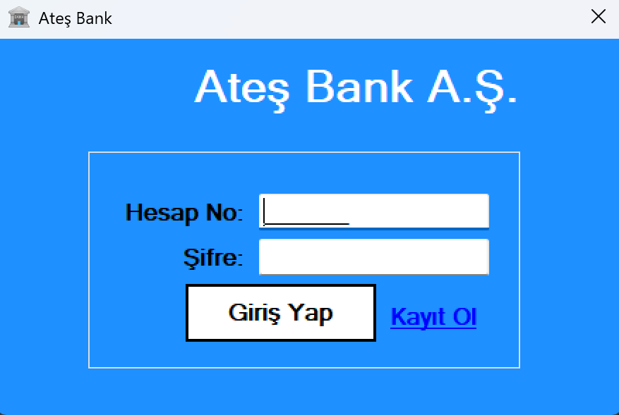

# 🏦 Banking System App - C# Windows Forms

This is a simple yet functional **Banking System** desktop application built with **C# Windows Forms** and connected to a **SQL Server** database. It simulates basic banking operations such as:

- Creating customer accounts
- Depositing and withdrawing money
- Sending money between users
- Transaction history tracking

## 📸 Images

## 🧩 Features

- 🔐 Secure login system (Customer Login with Account Number)
- 💸 Money transfer between accounts
- ➕ Deposit / ➖ Withdraw functionality
- 🧾 View transaction history
- 💾 SQL Server integration for persistent data
- 🪄 Clean and user-friendly Windows Forms UI

## 🛠️ Technologies Used

- C# (.NET Framework)
- Windows Forms
- SQL Server (LocalDB or full version)
- ADO.NET for database communication
